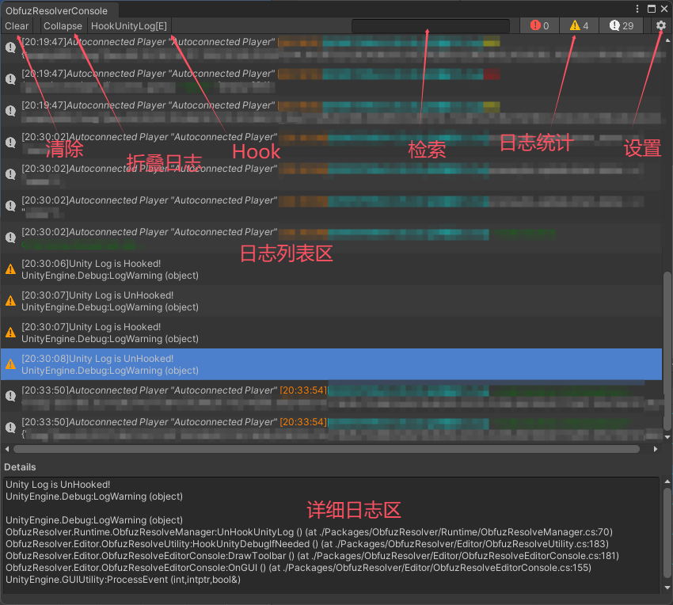
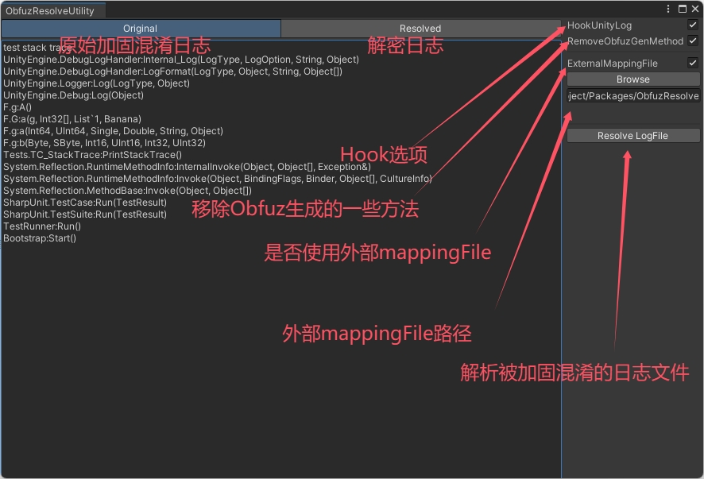

# ObfuzResolver

[CSDN](https://blog.csdn.net/xinjay1992/article/details/150548652) |[Github](https://github.com/xinjay/ObfuzResolver) | [Gitee](https://gitee.com/xinjay/obfuz-resolver)

ObfuzResolver是基于[obfuz-tools](https://github.com/focus-creative-games/obfuz-tools)针对[Obfuz](https://github.com/focus-creative-games/obfuz)的一项辅助工具，方便开发者在unity编辑器中或者运行时快捷将使用Obfuz混淆加固后的日志信息还原为原始信息，以辅助开发者快速定位Bug。

## 特性

- 支持unity编辑器模式下还原被加固混淆的日志信息；

- 支持运行时模式下还原被加固混淆的日志信息；

- 支持Hook掉unity Log，无缝与其它注册自`Application.logMessageReceived`的日志系统集成；

- 支持被加固混淆的unity日志文件还原；

- 提供运行时Log界面，方便查看实时日志信息；

## 支持的版本与平台

与Obfuz完全一致；

------

## 使用说明

### 安装

ObfuzResolver的Unity Package Manager URL安装地址：

- gitee `https://gitee.com/xinjay/ObfuzResolver.git`
- github `https://github.com/xinjay/ObfuzResolver.git`

打开Unity Package Manager窗口，点击`Add package from URL...`，填入以上地址之一即可完成安装。

### 菜单及界面说明

| 菜单                             | 描述                        |
|:------------------------------:|:-------------------------:|
| ObfuzResolver/Resolver Console | 打开unity编辑器模式下Resolver日志窗口 |

- ResolverConsole界面：
  
  
  
  - "**HookUnityLog/JookUnityLog[E]**"为Hook unity日志选项，其中[**E**]表示使用外部自定义mappingFile文件；
  
  - 通过USB或者网络连接真机设备后，便能在unity中实时查看还原后的真机日志信息；

- ResolverUtility窗口，点击上述"**设置按钮**"进入Utility窗口：
  
  
  
  - 首先指定需要使用的mappingFile，若不勾选"**ExternalMappingFile**"则以本地Obfuz配置的mappingFile路径为准；
  
  - 然后点击“**Original**”选项卡输入被混淆加固的日志，再点击"**Resolved**"选项卡即可获取还原后的日志；
  
  - 点击"**Resove LogFile**"按钮选择需要还原的日志文件；
  
  ### 运行时日志窗口
  
    
  
  - 首先将当前应用对应的mappingFile命名为**mapping.xml**并放置于应用的**Application.persistentDataPath**路径，比如‘/storage/emulated/0/Android/data/xxx/files/mapping.xml’；
  + 在代码中适当位置调用`ObfuzResolveManager.LoadObfuzResolver()`即可启动运行时日志窗口；
  + 启用**HookUnityLog**便能实时查看还原后的日志信息；

## 参考

- (Obfuz) [Gitee](https://gitee.com/focus-creative-games/obfuz) | [Github](https://github.com/focus-creative-games/obfuz)

- (obfuz-tools) [Gitee](https://gitee.com/focus-creative-games/obfuz-tools) | [Github](https://github.com/focus-creative-games/obfuz-tools)

- (MonoHook) [Github](https://github.com/Misaka-Mikoto-Tech/MonoHook)
